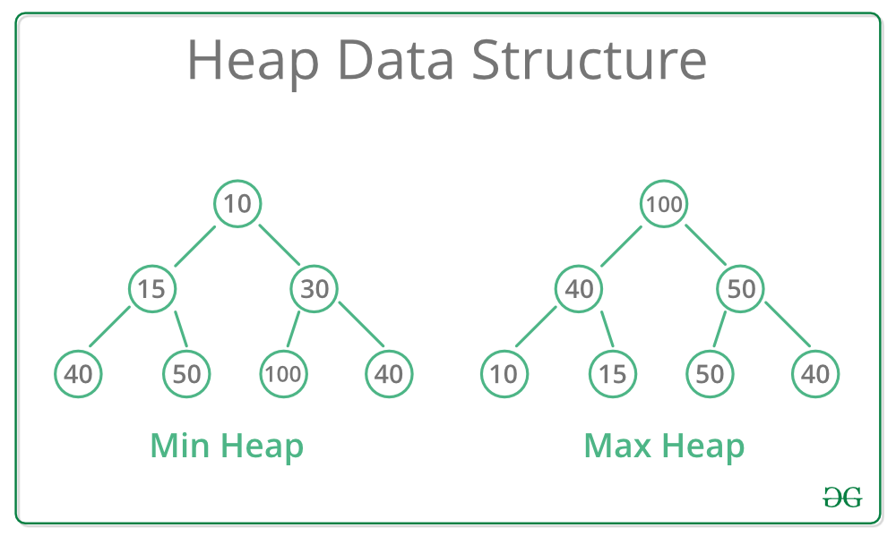

# Module 07: Heap - The King of Priority

## 1. The Concept: Emergency Room Triage
In a normal Queue (FIFO), if you arrive first, you get served first.
But in a **Heap (Priority Queue)**, it works like an Emergency Room:
* **The Rule:** The patient with the most critical condition (Highest Value) gets the doctor **immediately**, even if they arrived last.
* **The Structure:** It looks like a Tree, but it's packed tightly into an Array.

> **Max-Heap:** The Boss (Largest number) is always at the Root.
> **Min-Heap:** The Smallest number is always at the Root.





---

## 2. The "Array Trick"
We don't use `struct Node *left, *right` here. We use simple math to find family members in a standard Array.

If a Node is at index `i`:
* **Left Child:** `2*i + 1`
* **Right Child:** `2*i + 2`
* **Parent:** `(i - 1) / 2`

**Why?** This makes Heaps incredibly memory-efficient (no pointers!) and cache-friendly.


---

## 3. Core Operations (The "Bubble" Dance)
Maintaining the Heap property involves moving nodes up or down.

### 3.1. Insert (O(log n)) - "Bubble Up"
1. Add the new guy to the very end of the array (bottom of the tree).
2. If he is stronger than his parent, swap them.
3. Repeat until he finds his rightful place.

### 3.2. Extract Max (O(log n)) - "Bubble Down"
1. Remove the King (Root).
2. Move the last element (the weakest guy) to the Root (Temporary throne).
3. He looks at his children. If a child is stronger, swap with the strongest child.
4. Repeat until he sinks to his level.


---

## 4. C Implementation (Max-Heap)
Here is how we implement a Max-Heap using a static array.

```c
#include <stdio.h>

#define MAX_SIZE 100

typedef struct {
    int data[MAX_SIZE];
    int size;
} MaxHeap;

// Helper: Swap two integers
void swap(int* a, int* b) {
    int temp = *a;
    *a = *b;
    *b = temp;
}

// Operation: Bubble Up (for Insert)
void heapify_up(MaxHeap* h, int index) {
    if (index == 0) return; // Reached root

    int parent_index = (index - 1) / 2;

    // If I am greater than my boss, I take his spot
    if (h->data[index] > h->data[parent_index]) {
        swap(&h->data[index], &h->data[parent_index]);
        heapify_up(h, parent_index); // Continue climbing
    }
}

// Operation: Bubble Down (for Extract Max)
void heapify_down(MaxHeap* h, int index) {
    int left = 2 * index + 1;
    int right = 2 * index + 2;
    int largest = index;

    // Find the strongest among: Me, Left Child, Right Child
    if (left < h->size && h->data[left] > h->data[largest]) {
        largest = left;
    }
    if (right < h->size && h->data[right] > h->data[largest]) {
        largest = right;
    }

    // If I'm not the largest, swap and sink down
    if (largest != index) {
        swap(&h->data[index], &h->data[largest]);
        heapify_down(h, largest);
    }
}

// API: Insert
void insert(MaxHeap* h, int value) {
    if (h->size >= MAX_SIZE) return; // Overflow
    
    // 1. Add to end
    h->data[h->size] = value;
    int current_index = h->size;
    h->size++;
    
    // 2. Fix order
    heapify_up(h, current_index);
}

// API: Extract Max
int extract_max(MaxHeap* h) {
    if (h->size <= 0) return -1; // Underflow
    
    int root_value = h->data[0];
    
    // 1. Move last element to root
    h->data[0] = h->data[h->size - 1];
    h->size--;
    
    // 2. Fix order
    heapify_down(h, 0);
    
    return root_value;
}
```

---

## 5. Performance Analysis

| Operation | Time Complexity | Why? |
| :--- | :--- | :--- | :--- |
| **Peek (Get Max)** | $O(1)$ | It's always at index 0. |
| **Insert** | $O(\log n)$ | You climb the height of the tree. |
| **Delete (Extract)** | $O(\log n)$ | You sink down the height of the tree. | 
| **Build Heap** | $O(n)$ | Magic! (Using bottom-up approach). | 
| **Search** | $O(n)$ | It is NOT a Search Tree. Use BST for searching. | 

**My Take:** Don't confuse Heap with BST.
* BST is for **Searching** ($Left < Root < Right$).
* Heap is for **Priority** ($Parent > Children$). Left/Right relationship doesn't matter in Heap.
