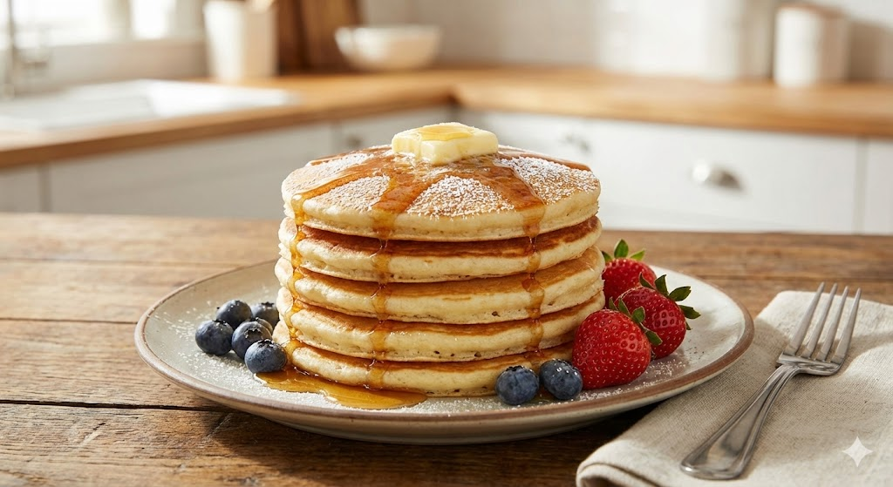
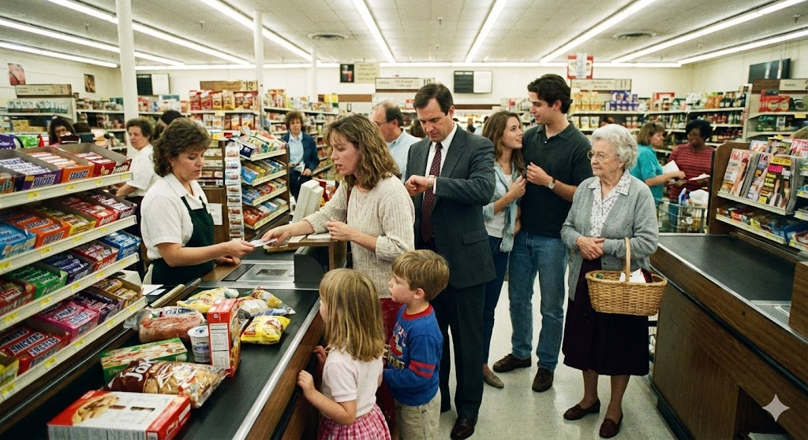

# Stack & Queue: The Rules of Order 📚

## 1. Stack - The LIFO Rule 🥞
> **Analogy:** Imagine a stack of pancakes or plates.

* **Rule:** **LIFO** (Last In, First Out). The item you put in **Last** sits on top, so it must be taken out **First**.
* **Operations:**
    * `Push`: Add an item to the top.
    * `Pop`: Remove the item from the top.
* **Use Cases:** The "Undo" button in Word, function calls in programming (recursion).

*Visual: The last pancake placed on top is the first one eaten.*

---

## 2. Queue - The FIFO Rule 🚶‍♂️🚶‍♀️
> **Analogy:** Imagine a line of people at a checkout counter.

* **Rule:** **FIFO** (First In, First Out). The person who arrives **First** gets served **First**.
* **Operations:**
    * `Enqueue`: Add an item to the **Rear** (back).
    * `Dequeue`: Remove an item from the **Front**.
* **Use Cases:** Printer jobs (first document sent prints first), handling web server requests.

*Visual: The first person in line gets served first.*

---

## 3. How to build them? (Comparison) 🏗️

### A. Using an Array (The Box) 📦
* **Concept:** Use a fixed block of memory.
* **Queue Trick:** Uses **Circular Logic**. When you reach the end of the array, you wrap around to the beginning to reuse empty spots.
* **Pros:** Fast access.
* **Cons:** Can get full (**Overflow**).

### B. Using a Linked List (The Chain) 🔗
* **Concept:** Dynamic nodes connected by pointers.
* **Pros:** Can grow as big as needed (**Dynamic memory**).
* **Cons:** Need extra memory for the pointers.

---

### 📝 SUMMARY OF THE LESSON (THE BIG TAKEAWAY)
> "A stack is a box that's stacked on top of each other (**Last In, First Out**). A queue is a tube that's arranged in a line (**First In, First Out**). If you want to save memory and know the number beforehand, use an **Array**. If you want flexibility and unlimited number, use a **Linked List**."
